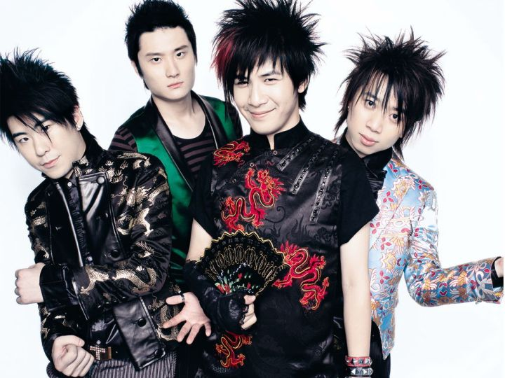
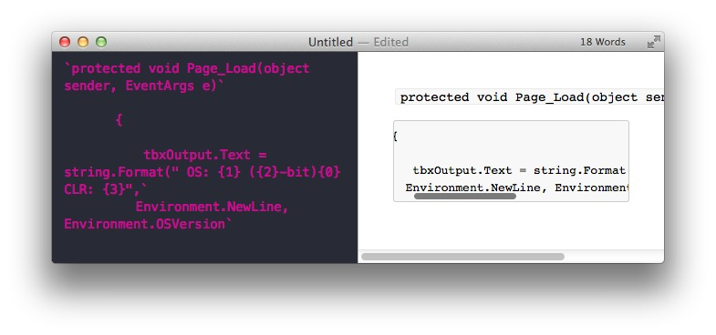

早上好呀各位！
_又是新的一天~_
今天主要来试用一下wiz的Markdown功能：
# 我是标题
## 我也是标题
### 我们都是标题
#### 我们都是标题
##### 我们都是标题
###### 我们都是标题
**粗体**
_斜体_
> 
> 
> 这是引用
> 
> 
### 无序列表
*   项目1
*   项目2
*   项目3
### 有序列表
1.  项目5
2.  项目6
3.  项目7

* * *

**【01】**
在知乎上看到一则比较有趣的回答，直接搬过来了：
[有哪些歌词叙事性很强的歌曲？- 知乎](https://www.zhihu.com/question/24868012)

> 
> 
> 太阳当空照，花儿对我笑。
> 小鸟说早早早，你为什么背上炸药包？
> 我去炸学校，老师不知道。
> 一拉线，我就跑。
> 回头一看学校没有了。
> 
> 

这才是真正歌词叙事性强的曲目，下面我们来逐句分析：

> 
> 
> 太阳当空照
> 
> 

1957年11月17日，毛主席接见留学生时说道：“你们青年人朝气蓬勃，正在兴旺时期，好像早晨八九点钟的太阳。”毛主席讲“青年人像八九点钟的太阳”，意思是他们正处在快速上升时期，而不是“如日中天”、“当空照”。而我国中小学的上学时间一般都在早晨七点左右，此时也就天亮不久，更不会出现“太阳当空照”的景象。也就是说，歌词中的“我”上学的时候，人家都已经开始做课间操了。故事的开头交代了时间，并隐晦地表现出“我”已经迟到了，渲染了一种悲剧的氛围，为后文的大崩坏作情感上的铺垫。

> 
> 
> 花儿对我笑
> 
> 

“我”为什么刚起床准备上学就会碰到花儿？他们又为什么要对“我”笑？昨天晚上发生了什么？“我”为什么会迟到？
短短五个字，就说明“我”的社会关系复杂，小小年纪就涉足娱乐圈，表现出了主人公悲苦受压迫的身世，陈说了主人公最后投身革命的必然性和正确性。

> 
> 
> 小鸟说早早早
> 
> 

继“我”、“花儿”之后，故事中又出现了小鸟，直接描写的人物达到了三个（“花儿”是一个利益共同体，在叙事上算一个），超过了《东北人都是活雷锋》中的两个（老张和东北人，肇事司机没有正面出现不算），使得故事的复杂度陡然上升了一个凳次，叙事性几何增长。再来看这个“小鸟”何许人也，嫌疑人有三个：

**1.南小鸟：**

**2.鹰鸟小鸟：**

**3.小鸟游十花：**

（六花是贫乳不算）仅从歌词我们难以确定倒底是哪个小鸟，但是有一点，这三个小鸟都是日本人，他们说的“早早早”，其实是写作“早く”读作“はやく hayaku”，并不是在问好而是在催促“我”赶紧麻溜的。这就从侧面进一步证实了“我”已经迟到的事实。

> 
> 
> 你为什么背上炸药包？
> 
> 

故事到这里急转直下，突然就出现了大规模杀伤性武器，将紧张的气氛烘托到了顶点，并提出疑问，设置悬念，吸引听歌人的注意。歌词至此已经完成紧凑的第一部分“序”，紧接着是第二部分：
歌词的描写对象由第一人称所见的“太阳”、“花儿”、“小鸟”一转而成为第三人称，直击没有露面的“我”，如流水一般点破上文铺陈的阴谋。这里的“我”，虽然没有相貌描写，但可以想见应该是一个喜欢搞爆破的中二病少年，当他的阴谋被小鸟揭穿之后，他不思悔改，反而露出一脸邪魅的笑：

> 
> 
> 我去炸学校，老师不知道。
> 一拉线，我就跑。
> 回头一看学校没有了。
> 
> 

三句并为一句，一气呵成，是阶级矛盾积累到一定程度之后的爆发。再细仍有看点：

> 
> 
> 老师不知道
> 
> 

前文铁证如山，“我”已经迟到了，而老师竟然不知道今天少了一个学生，对即将到来的定向爆破毫无防范，才使得这场战斗如摧枯拉朽一般。这里的“老师”一反师道尊严，成为了腐朽堕落、昏庸颟顸的统治阶级代表。

> 
> 
> 一拉线，我就跑。
> 
> 

简简单单六个字，我们可以从中管窥“我”的战术精髓。这里显然“我”采用的是一种hit&run战术，因为我代表的是被敲骨吸髓的阶级，物质基础一定是薄弱的，目前还不具备正面宣战的能力，所以要转入地下打游击战。把线一拉，管它响不响，先撤退保存有生力量，方是斗争的第一要务。

> 
> 
> 回头一看学校没有了。
> 
> 

这一句不仅是交代了作战的结果——学校已经夷为平地，更是留给了听众一种思考：学校没有了，之后怎么办呢？大破大立，“我”已经搞完了破坏，后面的经济建设谁来搞？马上打天下岂能马上治天下？歌词全文叙事，但叙事为明线，议论为暗线，两者交相肱股，彰显叙事性。
最后，我发现这首歌是超越了民族、文化、国界的无产阶级之歌，以其叙事性强，十分容易翻译为各国文字，以飨世界听众，我试着写了一下：
>The sun is rock&roll, 
>flowers laughing out.
>Birds shout , piss off, 
>what the hell are you carrying for?
>Go to fuck school, 
>teachers won't be told.
>B eight four, stay no more.
>Turn around, fire in the hole.

* * *

**【02】**
来说说第二件事，
其实前段时间本来打算用OneNote，
然而：

* * *

**【03】**
Markdown基本操作：
(图片挂了)
不要小看Markdown哦，其实上面那几张图片都是超链接插入的图片哦，这样既节约了空间，又节省了时间~~
**放一段代码给你们看看：**

**没错，那首歌词分析中的所有图片都是超链接~**

这样就添加了一张图片~
不需要保存图片后再贴上来，只需要右键然后复制图片链接即可，方便实用~
而且Markdown还支持表格功能，只是有些麻烦而已~
下面插入一个表格：

| 原子序数 | 元素 | 元素符号 |
| --- | --- | --- |
| 01 | 氢 | H |
| 02 | 氦 | He |
| 03 | 锂 | Li |
| 04 | 铍 | Be |
| 05 | 硼 | B |

`:-`代表左对齐，
`:-:`代表居中，
`-:`代表右对齐。
插入代码也很简单，用\`\`将代码包裹起来即可，

* * *

**【04】**
嘛今天先说这么多~
明天见咯~
